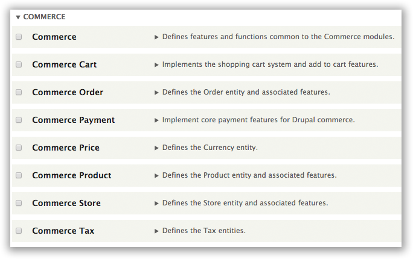

# Installing Drupal Commerce 2.x
[Composer Manager Module](https://drupal.org/project/composer_manager) &nbsp; | &nbsp; [Composer on Drupal Intro](https://bojanz.wordpress.com/2015/09/18/d8-composer-definitive-intro/) &nbsp; | &nbsp; [Community Docs](https://www.drupal.org/node/2405811)

_Note: Command-line examples use [Drupal Console](#installing-drupal-console) with the common alias "drupal", not Drush._

## Install Commerce 2

1. **Install Composer -** You must have composer installed in your system. ([Why?](https://bojanz.wordpress.com/2015/09/18/d8-composer-definitive-intro/) [How?](#installing-composer))

2. **Download Drupal 8 -** Download and extract the latest release of [Drupal 8](https://drupal.org/project/drupal).

 ```sh
 # Using Drupal Console can make this super easy
 drupal site:new commerce2
 cd commerce2
 cp sites/default/default.settings.php sites/default/settings.php
 ```

3. **Install Drupal 8** ([How to install Drupal 8](#installing-drupal-8))

4. **Download Commerce 2 -** Acquire the latest _**DEV**_ releases of Commerce 2 and dependencies: [commerce](https://drupal.org/project/commerce), [composer_manager](https://drupal.org/project/composer_manager), [address](https://drupal.org/project/address), [inline_entity_form](https://drupal.org/project/address), and [profile](https://github.com/fago/profile2)

 ```sh
 # These two are required before proceeding to the next step
 drupal module:download commerce;
 drupal module:download composer_manager;
 drupal module:download address;
 drupal module:download inline_entity_form;
 # The profile module needs a bit more help
 cd modules/contrib;
 wget https://github.com/fago/profile2/archive/8.x-1.x.zip;
 unzip 8.x-1.x.zip;
 mv profile2-8.x-1.x profile;
 ```

5. **Initialize Composer -** From the Drupal root directory, initialize composer_manager ([Why Composer?](https://bojanz.wordpress.com/2015/09/18/d8-composer-definitive-intro/)), and run it for the first time:

 ```sh
   # Move back down to the Drupal root
   cd ../../;
   php modules/contrib/composer_manager/scripts/init.php;
   composer drupal-update;
   drupal module:install composer_manager;
 ```

6. **Install Commerce -** Enable the Commerce modules, e.g.:

 ```sh
 # This line installs all commerce
 drupal module:install commerce commerce_order commerce_product commerce_tax commerce_cart commerce_payment profile;
 # This command is sometimes necessary to force the menu to rebuild;
 drupal cache:rebuild;
 ```


## Installing Drupal Console

You can go to [Drupal Console's website](http://drupalconsole.com/) for more documentation and support.

```sh
# Run this in your terminal to get the latest Console version:
curl -LSs http://drupalconsole.com/installer | php

# Or if you don't have curl:
php -r "readfile('http://drupalconsole.com/installer');" | php

# You can place this file anywhere you wish.
# If you put it in your PATH, you can access it globally.
# For example: move console.phar and rename it, 'drupal':
mv console.phar /usr/local/bin/drupal

# Show all available Drupal Console commands.
drupal
```

## Installing Composer

You can go to [GetComposer.com](https://getcomposer.org/doc/00-intro.md) for more documentation and support.

```sh
curl -sS https://getcomposer.org/installer | php
```

## Installing Drupal 8

Unforunately, Drupal 8 has to be installed manually. Feel free to pull request update this page with any drush or drupal console commands that have been recently added.


There is a big long list of requirements and steps including downloading the project, setting up a server, and making sure you have a database. Currently, the best place for accurate installation notes is the [INSTALL.txt file that comes with Drupal 8](https://api.drupal.org/api/drupal/core!INSTALL.txt/8). We expect drupal.org will have a much nicer step-by-step screenshot installation process posted soon.