
There are only about 20 administrative screens that come with Drupal
Commerce. Most of those screens are either Views or Settings Forms. Of particular
interest to store managers are the screens available for Product management.

        
Store Admin Screen

        
This is the screen you will see when you click on "Store" up in the top toolbar.

    

<ul class="screenshot_breadcrumbs">
        <li class="first">Drupal Commerce</li>
        <li>Administration</li>
        <li class="last">Store</li>
    </ul>

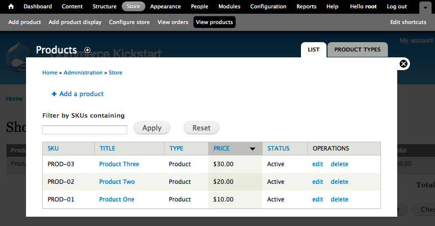

        
Product Listing

        
The Product Listing is pretty bare-bones to start with. Below we've
        made a simple exercise to add a few more filters and an image field.
        Since this is built with Views, the possibilities are literally
        endless.

    

<ul class="screenshot_breadcrumbs">
        <li class="first">Drupal Commerce</li>
        <li>Administration</li>
        <li>Store</li>
        <li class="last">Products</li>
    </ul>

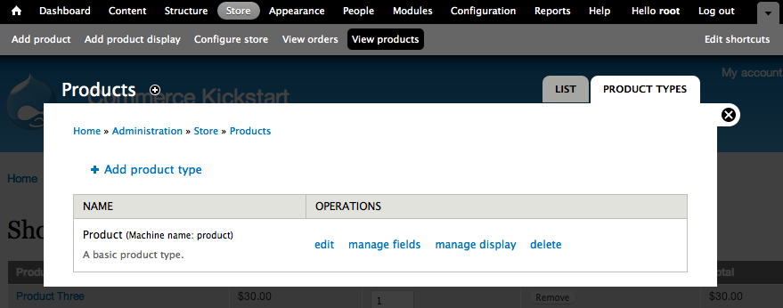

        
Product Types

        
The product types are documented in great detail in the <a
        href="Prod-Entity.html">Products as an Entity</a>.

    

<ul class="screenshot_breadcrumbs">
        <li class="first">Drupal Commerce</li>
        <li>Administration</li>
        <li>Store</li>
        <li>Products</li>
        <li class="last">Product Types</li>
    </ul>

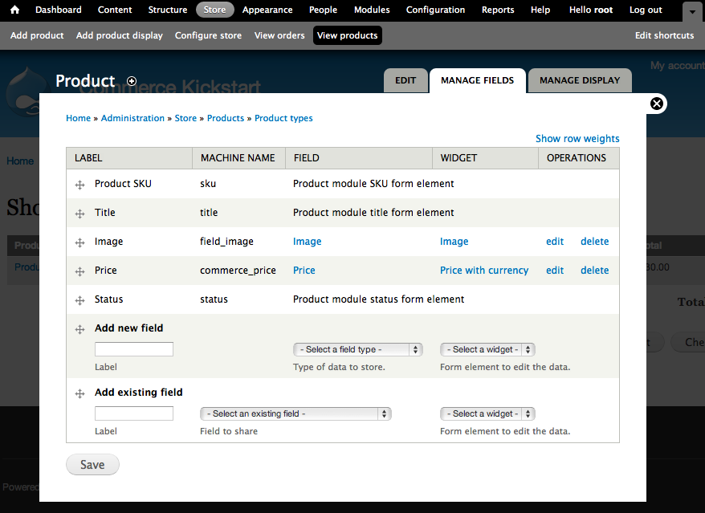

        
Manage Fields

        
If you click on "Manage Fields" from the standard Product Type this is what you will see. You will note that it is very similar to editing a content type, using the same interface to add fields to product types.See <a href="/user-guide/product-attributes-variations">Product Attributes &amp; Variations</a> for more information.

    

<ul class="screenshot_breadcrumbs">
        <li class="first">Drupal Commerce</li>
        <li>Administration</li>
        <li>Store</li>
        <li>Products</li>
        <li>Product Types</li>
        <li class="last">Manage Fields</li>
    </ul>

        
Manage Product Display

        
This is where you manage how product fields will display in a variety of contexts, such as in the different view modes for product display nodes.

    

<ul class="screenshot_breadcrumbs">
        <li class="first">Drupal Commerce</li>
        <li>Administration</li>
        <li>Store</li>
        <li>Products</li>
        <li>Product Types</li>
        <li class="last">Manage Display</li>
    </ul>

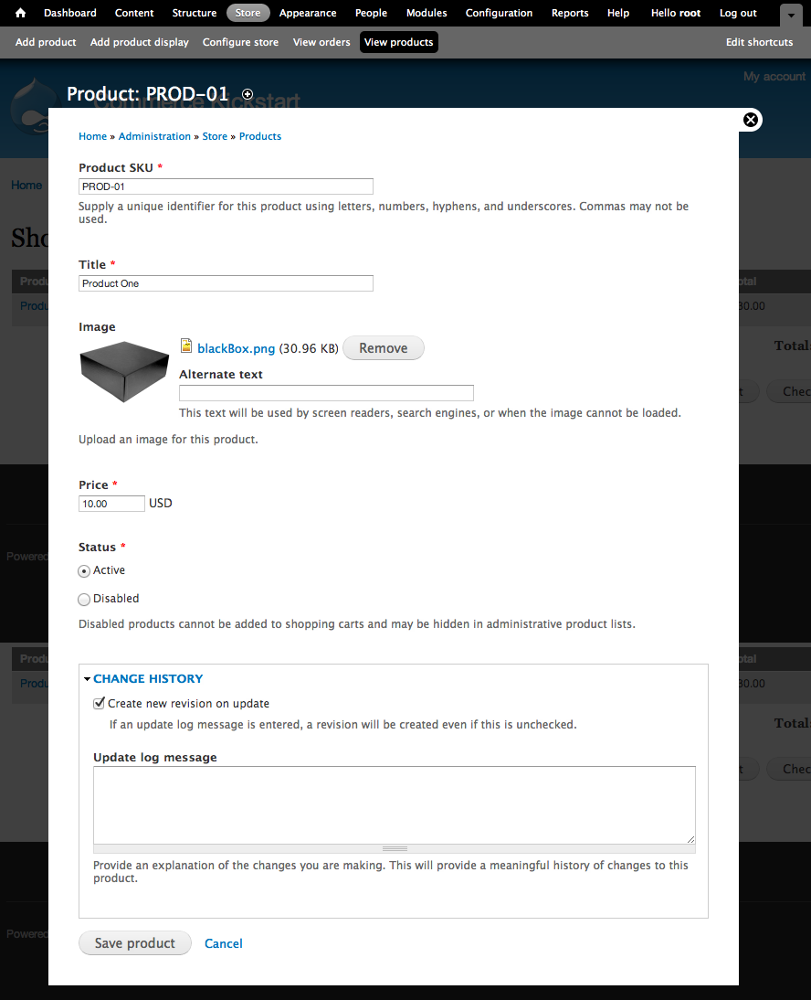

        
Product Edit Screen

        
We've included the product edit screen for your benefit to see the
        Product Entity form in all of it's glory. Pretty simple, we've got the
        Product SKU and Product Title that are required. Additionally, Commerce
        Kickstart has added the Image field. <a
        href="../cart/Cart-MultiCurrency.html">The Price can be changed to allow
        for multiple currencies</a>.

    

<ul class="screenshot_breadcrumbs">
        <li class="first">Drupal Commerce</li>
        <li>Administration</li>
        <li>Store</li>
        <li>Products</li>
        <li class="last">Edit Product</li>
    </ul>

<h2>Customizing On-site Product Administration</h2>

Because all the back-end interfaces in Drupal Commerce are default Views, you
have the ability to tailor each page to your needs. The product list includes a
simple SKU filter by default but can do much more for you through customization.
Below we include a simple exercise where we add an image field, hide the "type"
field, and extend a product title keyword filter.

        
Edit Product View

        
To start with we are going to use a shortcut to edit the product
        listing view. This is a very simple way to tweak nearly all of the
        Drupal Commerce administrative screens.

    

<ul class="screenshot_breadcrumbs">
        <li class="first">Drupal Commerce</li>
        <li>Administration</li>
        <li>Store</li>
        <li class="last">Products</li>
    </ul>

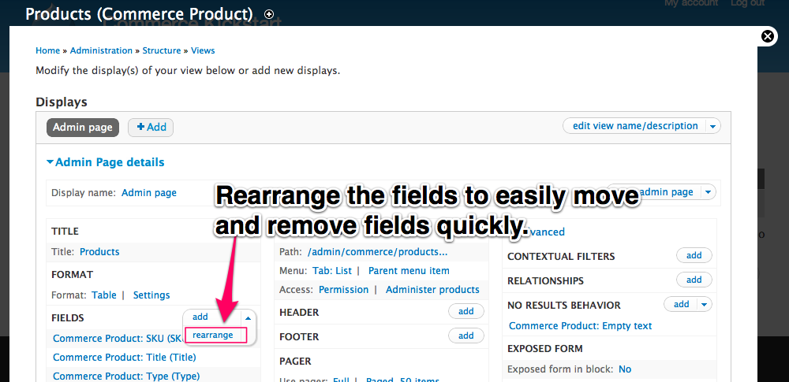

    

        
Remove Product Type

        
Our first step is to remove the product type. This will be replaced
        later on with an exposed filter.

    

<ul class="screenshot_breadcrumbs">
        <li class="first">Administration</li>
        <li>Structure</li>
        <li>Views</li>
        <li class="last">Edit View</li>
    </ul>

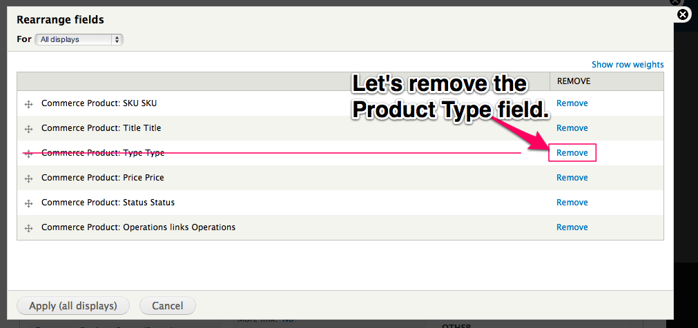

        
Remove Product Type

        
This is a great way to remove and re-order the fields on the product
        listing table. It's got a nice drag and drop feature as well as a very
        simple "Remove" capability.

    

<ul class="screenshot_breadcrumbs">
        <li class="first">Administration</li>
        <li>Structure</li>
        <li>Views</li>
        <li>Edit View</li>
        <li class="last">Rearrange Fields</li>
    </ul>

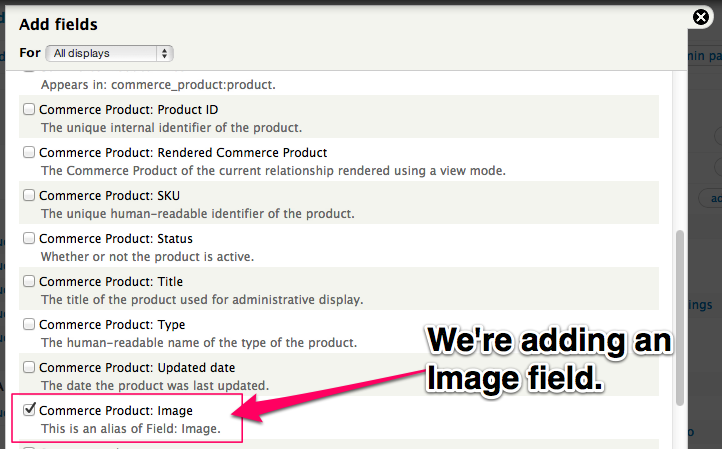

        
Add Image Field

        
Go ahead and click "Add" next to the fields list and select "Commerce
        Product: Image" which is about halfway down in the list. Imagine for a
        second how many fields are available here for your use. The most useful
        are probably the "Commerce Product" fields, but there are many more to
        choose from.

    

<ul class="screenshot_breadcrumbs">
        <li class="first">Administration</li>
        <li>Structure</li>
        <li>Views</li>
        <li>Edit View</li>
        <li class="last">Add Image Field</li>
    </ul>

        
Edit Field Image

        
We want to remove the default colon and change the image to display
        as a thumbnail. You may want to go back and re-arrange the fields so
        that the image field appears closer to the front of the table. <em>See
        Remove Product Type</em> up above.

    

<ul class="screenshot_breadcrumbs">
        <li class="first">Administration</li>
        <li>Structure</li>
        <li>Views</li>
        <li>Edit View</li>
        <li class="last">Edit Field Image</li>
    </ul>

        
Add Exposed Filters

        
Exposed filters are one of the coolest features of Views. They create
        a simple form at the top of the administrative interface and let you
        setup simple keyword searches and drop downs that are
        automatically generated.

    

<ul class="screenshot_breadcrumbs">
        <li class="first">Administration</li>
        <li>Structure</li>
        <li>Views</li>
        <li>Edit View</li>
        <li class="last">Add Exposed Filters</li>
    </ul>

        
Add Filter Criteria

        
Here we're adding two exposed filters. We're going to enable keyword
        search for Titles and drop down selection for Product Types.

    

<ul class="screenshot_breadcrumbs">
        <li class="first">Administration</li>
        <li>Structure</li>
        <li>Views</li>
        <li>Edit View</li>
        <li class="last">Add Filter Criteria</li>
    </ul>

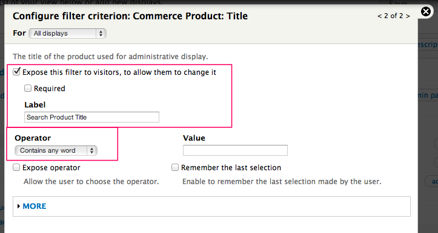

        
Configure Title Filter

        
For the title, we will expose the filter and change the operator to
        "Contains any word."

    

<ul class="screenshot_breadcrumbs">
        <li class="first">Administration</li>
        <li>Structure</li>
        <li>Views</li>
        <li>Edit View</li>
        <li class="last">Configure Title Filter</li>
    </ul>

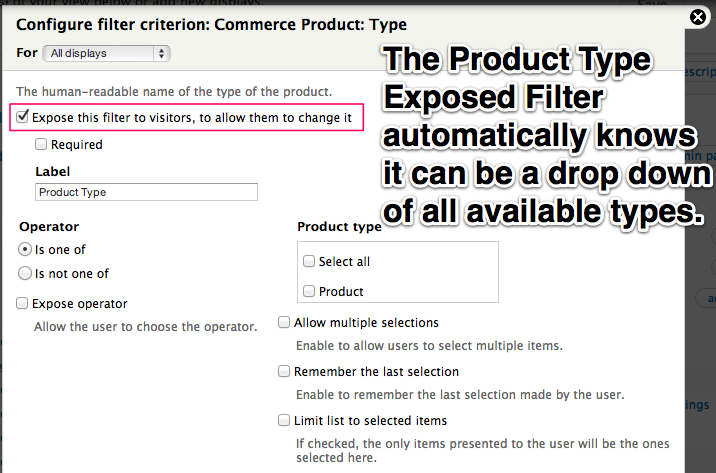

        
Configure Type Filter

        
The Product Type Exposed Filter automatically knows it can be a drop
        down of all available product types.

    

<ul class="screenshot_breadcrumbs">
        <li class="first">Administration</li>
        <li>Structure</li>
        <li>Views</li>
        <li>Edit View</li>
        <li class="last">Configure Type Filter</li>
    </ul>

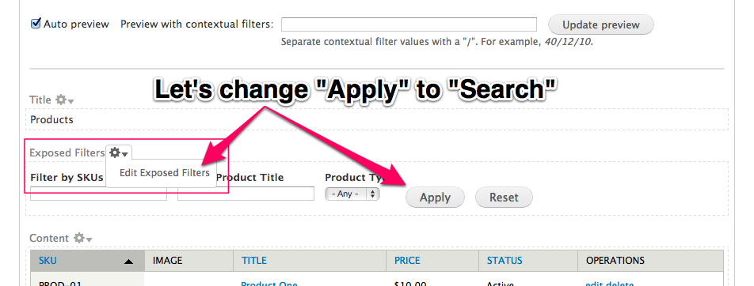

        
Submit Button Change

        
Lets change the exposed filter submit button from "Apply" to
        "Search."

    

<ul class="screenshot_breadcrumbs">
        <li class="first">Administration</li>
        <li>Structure</li>
        <li>Views</li>
        <li>Edit View</li>
        <li class="last">Submit Button Change</li>
    </ul>

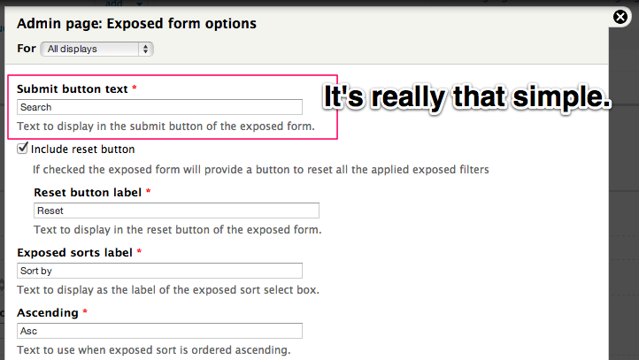

        
Change Submit Text

        
It's really that simple. Next we will view our product administration
        screen. Don't forget to save your View!

    

<ul class="screenshot_breadcrumbs">
        <li class="first">Administration</li>
        <li>Structure</li>
        <li>Views</li>
        <li>Edit View</li>
        <li class="last">Change Submit Text</li>
    </ul>

        
Product Admin Screen

        
Final Customized Drupal Commerce Product Administration Screen.

    

<ul class="screenshot_breadcrumbs">
        <li class="first">Drupal Commerce</li>
        <li>Administration</li>
        <li>Store</li>
        <li class="last">Products</li>
    </ul>

<h2>Contrib Product Administration</h2>

If you don't want to tweak Views on your own, we recommend using one or more
of the modules listed below to tweak your Drupal Commerce Product Administration
experience:

<ul>
    <li>Editable Fields - http://drupal.org/project/editablefields</li>
    <li>Commerce VBO Views - http://drupal.org/project/commerce_vbo_views</li>
    <li>Admin VBO Views - http://drupal.org/project/admin_vbo_views</li>
</ul>

On the drupalcommerce.org community site, there is a community-fueled list of
all available <a href=""http://www.drupalcommerce.org/contrib/admin>Drupal
Commerce Administrative Modules</a>.

<h2>Bulk Product Management with VBO</h2>

Using Views Bulk Operations will let you perform batch processes across your
whole product list or a subset of the list using specific operations or Rules
based operations. The Commerce VBO Views module provides a replacement default
product View with a VBO version you can use as an example. Note that it does not
overwrite the existing View but disables the default View and enables the VBO
View at the same URL.

Further integrating Editable Fields with the VBO powered View will also let
you edit individual field values within the View itself even without a batch
process.

