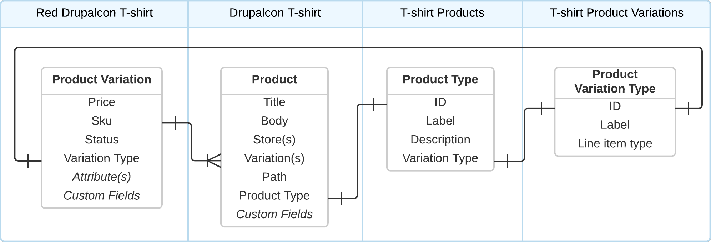

Drupal Commerce has many models and relationships. This page provides explainations as to how these different models related, including entity relationship diagrams.

**Orders** will only ever have one store, and it is stored as an entity
attribute.

-  Carts (which are Orders with additional functionality) can only
   contain products from one store.
-  You can use this architecture to limit which products can be put into
   carts together, based on physical location or for billing/taxes
   purposes.

**Products**, by default, have an entity reference field that targets
stores and allows one or more stores to be selected.

**Stores** are fieldable content entities (not configuration entities)
that contain a lot of information about the physical location of the
merchant. By default stores collect the following:

-  Name
-  Email Address
-  Default Currency
-  Address (used for determining taxes)
-  Supported billing countries
-  Owner
-  Default status (used to select a store when one isn’t given)
-  Tax information

