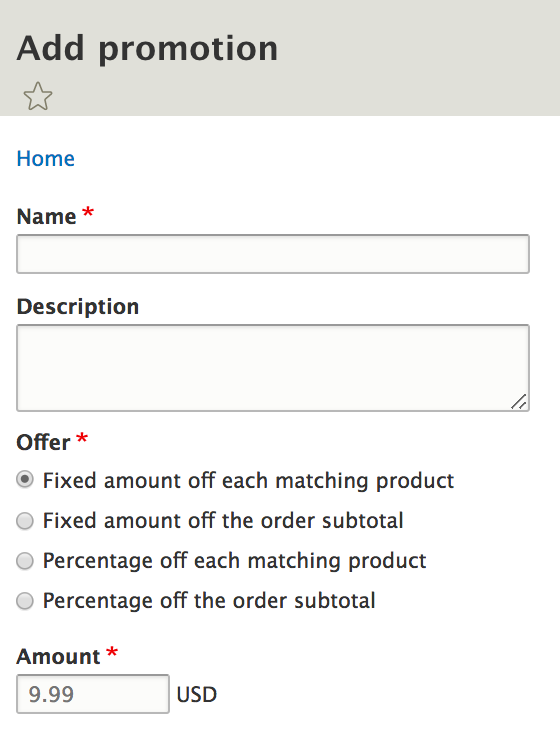
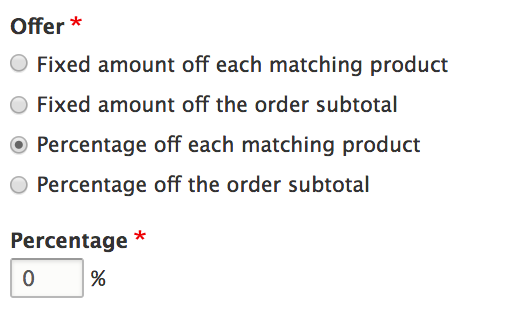
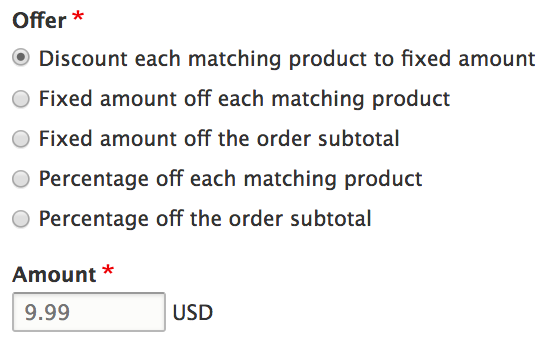

## Overview
Each Promotion has a single offer type. Offer types are implemented as plugins. To better understand how offer plugins are used to create the discounts that appear on orders, you first need to understand [order refresh and processing](https:../orders/order-refresh-and-process). Then take a look at the Promotion Entity apply() method. `web/modules/contrib/commerce/modules/promotion/src/Entity/Promotion.php`

In the Promotion apply() method, the apply method of the promotion's offer plugin is called. If the entity type of the Offer is commerce_order, then this statement applies:
  ``$offer->apply($order, $this);``
Otherwise, for each order item that matches the conditions of the Promotion, this statement applies:
  ``$offer->apply($order_item, $this);``
  
 ## Default offer types
 Commerce core includes 4 default offers. They are:
* Fixed amount off each matching product
* Fixed amount off the order subtotal
* Percentage off each matching product
* Percentage off the order subtotal
You can see the list of all available offers on the Promotion edit form:

For both the “Fixed amount off” options, an “Amount” data entry field will appear. If you switch the offer type to either of the “Percentage off” options, you will see the “Amount” data entry field change to a “Percentage” data entry field.

## Offer type interface and base class
PromotionOfferInterface `web/modules/contrib/commerce/modules/promotion/src/Plugin/Commerce/PromotionOffer/PromotionOfferInterface.php` extends a few standard core plugin interfaces and defines two new methods. The first is:
``public function getEntityTypeId();``
This method needs to return either ‘commerce_order’ or ‘commerce_order_item’, since these are the two entity types to which adjustments can be applied. And ultimately, that’s what we’re trying to do with our offer plugin: add a promotion adjustment to either an order item or the entire order (subtotal). Normally, when you create your custom offer plugin, you’ll want to extend the `PromotionOfferBase` class, which will provide the implementation for the getEntityTypeId() method as well as some other useful base code.
That brings us to the second method defined in the PromotionOfferInterface:
``public function apply(EntityInterface $entity, PromotionInterface $promotion);``
This is where we’ll implement all the logic that makes the offer plugin work. You can look at the implementations of the apply() method in each of the four default offer types plugins (located in the same place as the interface and base class). In each, the amount of the adjustment is determined based on the entity (order or order item) values and the offer type configration values. Then a new "promotion" Adjustment is created and added to the entity.

## Offer type configuration
One part of creating a custom promotion offer plugin is to define the configuration and build the corresponding form (with submit, validate methods.) You can see how this is done for the two “fixed amount off” and two “percentage off” offer types by reviewing the code in the following two files:
``web/modules/contrib/commerce/modules/promotion/src/Plugin/Commerce/PromotionOffer/FixedAmountOffBase.php
web/modules/contrib/commerce/modules/promotion/src/Plugin/Commerce/PromotionOffer/PercentageOffBase.php``

## A simple example
Let’s create a custom offer type that will discount order items to a fixed amount. Note that this plugin is not “production-ready.” It works in isolation but would not function properly if combined with any other discounts.

We’ll assume we have a custom module we can use named “my_module”. We’ll start by a new file named `OrderItemFixedAmountTarget.php` in:
`web/modules/custom/my_module/src/Plugin/Commerce/PromotionOffer`. Since this custom plugin is so similar to the `OrderItemFixedAmountOff` plugin, we’ll extend the `FixedAmountOffBase` class instead of extending `PromotionOfferBase`. After namespacing the class and including appropriate use statements, we need an annotation right befor our class code, like this:
 ``* @CommercePromotionOffer(
 *   id = "my_module_fixed_amount_target",
 *   label = @Translation("Discount each matching product to fixed amount"),
 *   entity_type = "commerce_order_item",
 * ) 
 class OrderItemFixedAmountTarget extends FixedAmountOffBase {
 ``
As in other plugin definitions, `id` needs to be a unique machine name. The `label` will appear on the Promotion edit form in the list of Offer choices. And since this will be an order item offer, the entity_type is set to “commerce_order_item.” (The alternative is "commerce_order". Once we enable our custom module (or rebuild the plugins cache if the module is already enabled), you should see the new Offer option, like this:

Since `FixedAmountOffBase` takes care of all the configuration code, all we need to do for our custom offer type is implement the `apply()` method.
``
  public function apply(EntityInterface $entity, PromotionInterface $promotion) {
    $this->assertEntity($entity);
    /** @var \Drupal\commerce_order\Entity\OrderItemInterface $order_item */
    $order_item = $entity;
    $unit_price = $order_item->getUnitPrice();
    $target_amount = $this->getAmount();
    if ($unit_price->getCurrencyCode() != $target_amount->getCurrencyCode()) {
      return;
    }
    // Don't raise the order item unit price to a higher target value.
    if ($target_amount->greaterThan($unit_price)) {
      return;
    }

    // Adjust unit price to the target amount.
    $adjustment_amount = $unit_price->subtract($target_amount);

    $order_item->addAdjustment(new Adjustment([
      'type' => 'promotion',
      // @todo Change to label from UI when added in #2770731.
      'label' => t('Discount'),
      'amount' => $adjustment_amount->multiply('-1'),
      'source_id' => $promotion->id(),
    ]));
  }
``
## Slightly more advanced example
Let's suppose that instead of discounting all matching order items to a fixed price, we only want to discount a set quantity of the order items. For example, if we wanted to make just one of the order items free, we would set quantity to 1 and the discount amount to 0. No matter what quantity of order items we have, the discount will remain fixed at the value of the order item price.
So, in this example, we will need to implement our own configuration, and we will extend `PromotionOfferBase` instead of `FixedAmountOffBase`. Here's what our annotation looks like:
``
/**
 * Discounts a set quantity of items to fixed amount.
 *
 * @CommercePromotionOffer(
 *   id = "my_module_discount_to_fixed",
 *   label = @Translation("Discount items of each matching product to fixed amount"),
 *   entity_type = "commerce_order_item",
 * )
 */
class OrderItemDiscountToFixed extends PromotionOfferBase {
``
For our configuration, we need two values, an integer `quantity` and a Price `amount`:
``
  public function defaultConfiguration() {
    return [
      'quantity' => 1,
      'amount' => NULL,
    ] + parent::defaultConfiguration();
  }
``
To see the configuration form build/validate/submit methods, you can view the [full source code](https://gist.github.com/lisastreeter/d7bfeff9ef948c4cd3e7a1daad1c9b63). Here's what our configuration form looks like on the Promotion edit page:

It is very similar to the code provided in `FixedAmountOffBase`. We just needed to handle the quantity value in addition to the amount. Similarly, our `apply()` method closely resembles the `apply()` method in our Simple Example above and the `OrderItemFixedAmountOff` offer type. After some error checking, we calculate the adjustment amount like this:

``
    // Calculate per-item reduction amount.
    $adjustment_amount = $unit_price->subtract($target_amount);
    $adjustment_amount = $adjustment_amount->multiply($offer_quantity);
    // Adjustment amount is multiplied by quantity when applied so we divide here.
    $adjustment_amount = $adjustment_amount->divide($quantity);
``
Then, we create and add an `Adjustment` to the order type, just as we did in the simple example.
