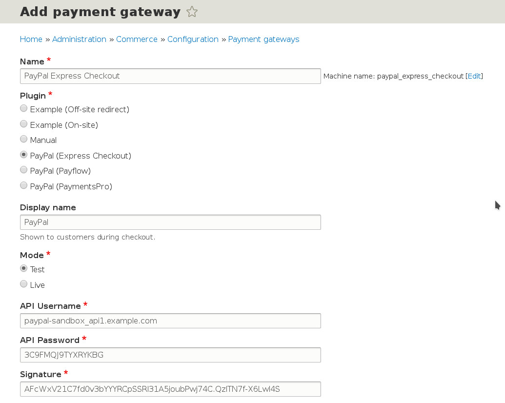

While configuring your store you would probably want to install and configure a payment gateway provider module so that you can accept online payments. Currently available payment gateways for Commerce 2 are listed `here <available-payment-gateways.html>`_.

This tutorial will guide you through configuring a payment gateway provider using the Commerce PayPal module as an example.

Install the Module
------------------

The first step is to install the module that provides integration with the desired payment gateway. In this case, Commerce PayPal. Drupal Commerce requires Composer and most related modules would have the same requirement - see `Using Composer </v2/getting-started/composer.html>`_. For specific installation instructions check the module's documentation.

Add a Payment Gateway
---------------------

Once you have installed the Commerce PayPal module, visit ``/admin/commerce/config/payment-gateways`` and click the ``Add payment gateway`` button. Fill in the details in the form. The Plugin option that you choose will define which payment gateway provider and integration type will be associated with our store's payment gateway that we're creating. There may be multiple modules installed each providing a number of options, as seen in the example below. For the purposes of this example, we'll be using the PayPal Express Checkout option. Once you select the desired option, the form will update allowing you to enter the configuration that is specific to it, such as API credentials - have a look at all settings provided.

For the Mode setting, it is recommended that you choose the Test option while developing. You will be able to set the Mode to Live once you have tested the integration and deployed your site to the production environment.

   Adding a Payment Gateway

Once the form is saved, you should be able to see the new payment gateway in the list.

Paying at Checkout
------------------

Once a payment gateway is added it will be made available as a payment method to customers of the store during the checkout process (unless it has been disabled). If there is only one payment gateway defined, it will be used by default. If there are more than one, the customer will be given the choice to choose a payment method as in the example below.

